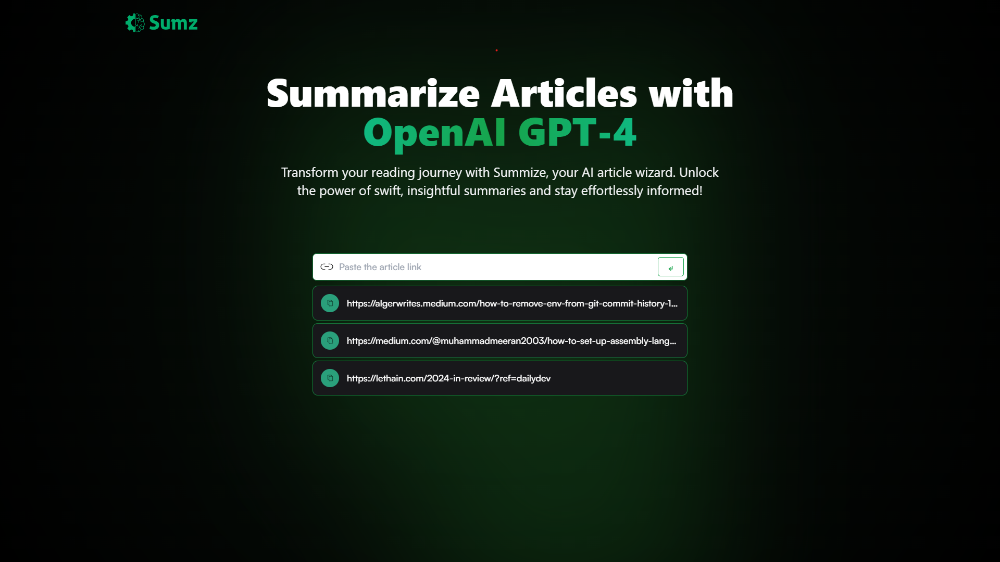

<div align="center"> <br /> <a href="https://openai-article-shortener.netlify.app/" target="_blank">
 <h1 align="center">📰 Sumz</h1>
  </a> <br /> <div>
    
   
  
</div>
 <h3 align="center">A React-based web application for summarizing articles using an AI-powered service</h3>
  <p align="center">Easily input article links, retrieve summaries, and browse your history of summarized articles.</p> </div>

## 📋 <a name="table">Table of Contents</a>

1. 🤖 [Introduction](#introduction)
2. ⚙️ [Tech Stack](#tech-stack)
3. 🔋 [Features](#features)
4. 🤸 [Quick Start](#quick-start)
5. 🕸️ [Snippets](#snippets)
6. 🔗 [Links](#links)
7. 🚀 [More](#more)

## <a name="introduction">🤖 Introduction</a>

The AI Article Summarizer is a web application that leverages React to provide the following features:

- **Summarize Articles**: Users can input the URL of an article, and the application will fetch and display a summary of the article's content using an AI-powered service.
- **Browse History**: The application stores a history of summarized articles, allowing users to click on a previously summarized article to view its summary again.
- **Copy URL**: Users can copy the URL of a summarized article to their clipboard for easy sharing.

## <a name="tech-stack">⚙️ Tech Stack</a>

- Node.js
- React
- Redux Toolkit
- RTK Query
- Tailwind CSS

## <a name="features">🔋 Features</a>

👉 **Summarize Articles:** Input the URL of an article to get a concise summary using AI.

👉 **Browse History:** View a list of previously summarized articles and revisit their summaries.

👉 **Copy URL:** Easily copy the URL of a summarized article to your clipboard.

👉 **Local Storage:** Store and retrieve the history of summarized articles using local storage.

## <a name="quick-start">🤸 Quick Start</a>

Follow these steps to set up the project locally on your machine.

**Prerequisites**

Make sure you have the following installed on your machine:

- [Git](https://git-scm.com/)
- [Node.js](https://nodejs.org/en)
- [npm](https://www.npmjs.com/) (Node Package Manager)

**Cloning the Repository**

```bash
git clone https://github.com/TheODDYSEY/AI-Summarizer-SaaS.git
cd AI-Summarizer-SaaS
```


Install the required dependencies:

   ```bash
   npm install
   ```

Start the development server:

   ```bash
   npm start
   ```

   This will start the application locally, and you can access it in your web browser at `http://localhost:3000`.

## Usage

1. **Summarize an Article**:
   - Enter the URL of the article you want to summarize in the input field.
   - Press the Enter key or click the submit button.
   - The application will fetch and display the summary of the article.

2. **Browse History**:
   - Scroll down to see a list of previously summarized articles.
   - Click on any article in the history list to view its summary.

3. **Copy URL**:
   - To copy the URL of a summarized article to your clipboard, click the copy icon next to the article in the history list.
   - You will receive feedback in the form of an icon change and a notification.

## Folder Structure

The project has the following folder structure:

- `src/`: Contains the React application source code.
  - `components/`: React components used in the application.
  - `assets/`: Static assets such as images.
  - `services/`: API service integration.
- `public/`: Contains the public assets and the HTML template.

## Contributing

Contributions are welcome! If you'd like to contribute to this project, please follow these steps:

1. Fork the repository.
2. Create a new branch for your feature or bug fix: `git checkout -b feature-name`.
3. Make your changes and commit them: `git commit -m 'Add new feature'`.
4. Push to your forked repository: `git push origin feature-name`.
5. Create a pull request to the `main` branch of the original repository.

## License

This project is licensed under the MIT License - see the [LICENSE](LICENSE) file for details.

Feel free to use, modify, and distribute this code according to the terms of the MIT License.
